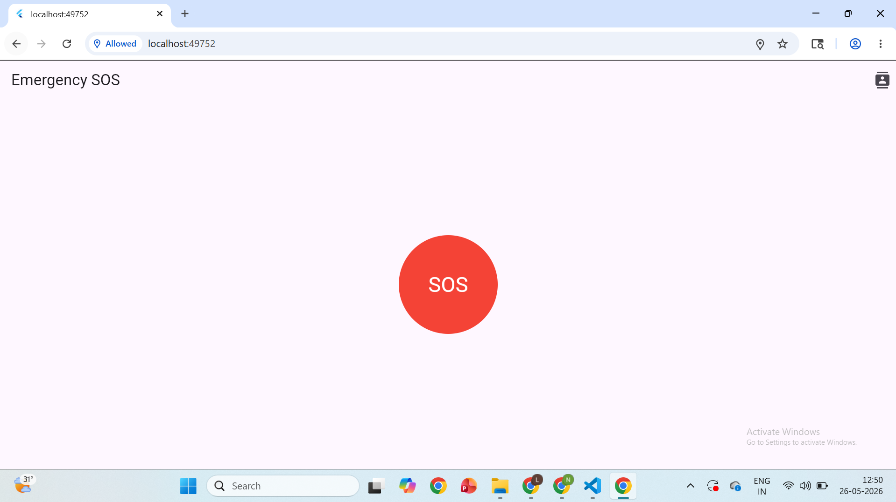
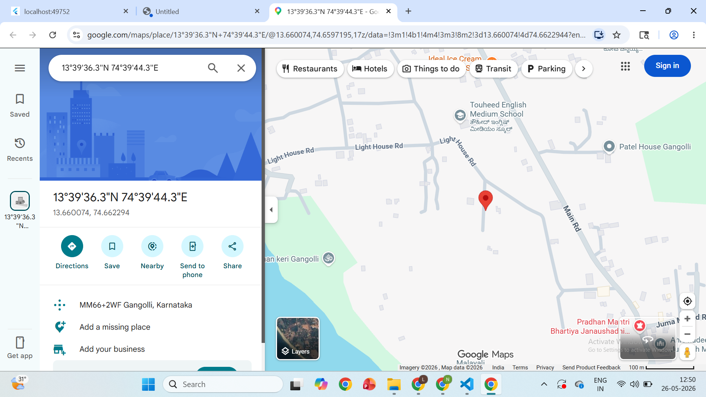
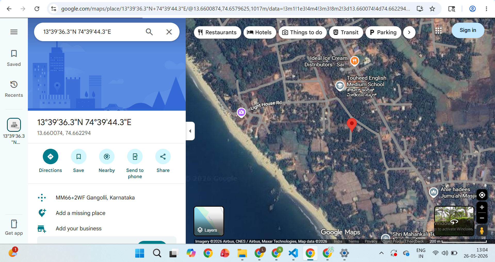
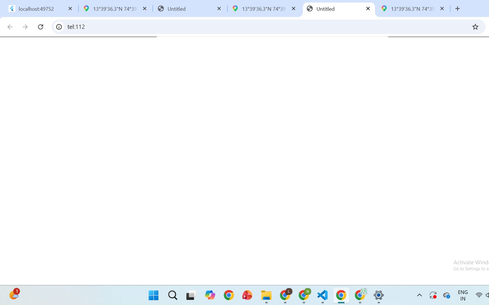
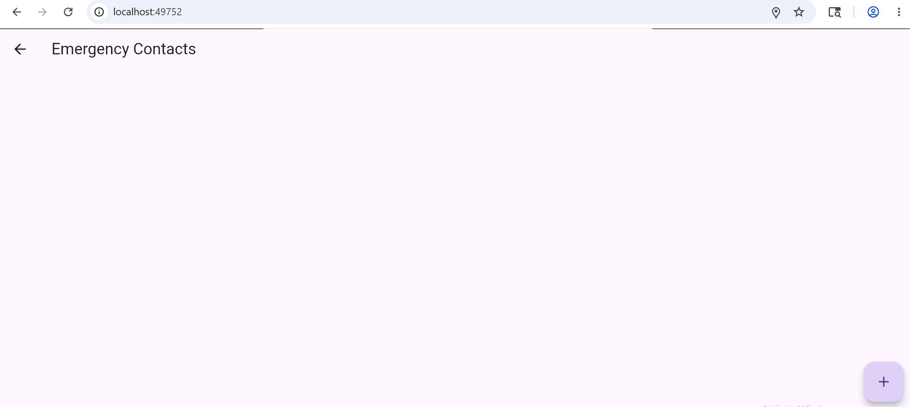
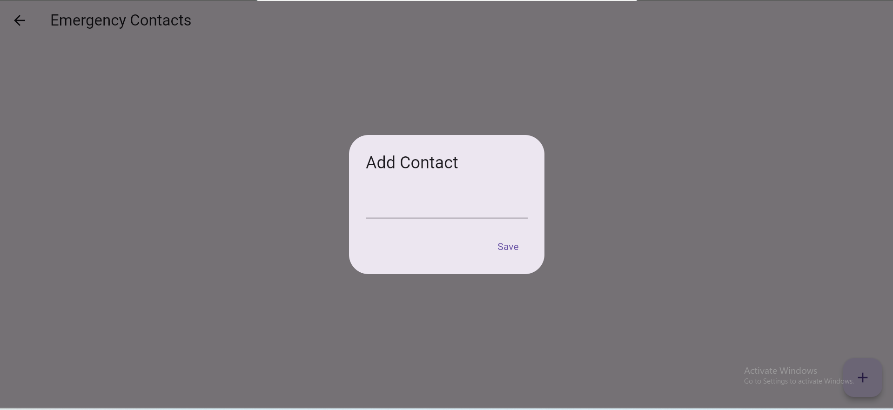
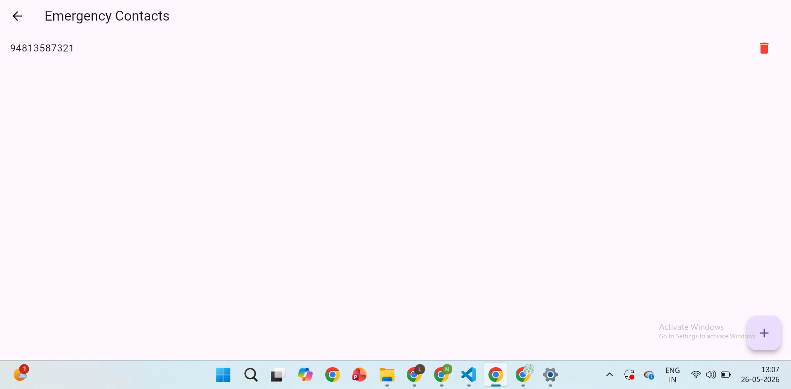

# Emergency SOS App using Flutter

## Overview
Emergency SOS is a Flutter-based emergency assistance application designed to help users quickly access emergency support during critical situations. The app provides live location tracking, Google Maps integration, emergency contact management, and emergency calling functionality.

---

## Features
- One-tap SOS emergency button
- Live location tracking using Geolocator
- Opens current location directly in Google Maps
- Emergency calling support
- Emergency contact management
- Add and delete emergency contacts
- Stores contact details locally using Shared Preferences
- Responsive Flutter UI for web and mobile devices

---

## Technologies Used
- Flutter
- Dart
- Geolocator
- URL Launcher
- Flutter SMS
- Shared Preferences
- Google Maps

---

## Packages Used

```yaml
geolocator
url_launcher
flutter_sms
shared_preferences
```

---

# Screenshots

## Main SOS Screen


---

## Live Location in Google Maps


---

## Satellite Map View


---

## Emergency Call Feature


---

## Emergency Contacts Screen


---

## Add Emergency Contact


---

## Saved Emergency Contact


---

## How It Works
1. User opens the Emergency SOS app.
2. User presses the SOS button.
3. The app fetches the current live location.
4. The location opens directly in Google Maps.
5. Emergency contacts can be added and managed.
6. The app can initiate emergency calling on supported mobile devices.

---

## Note
The emergency calling feature may not work properly on desktop or laptop browsers because browsers do not support native phone dialer functionality. This feature is intended for Android and iOS mobile devices.

---

## How to Run the Project

### Install Dependencies

```bash
flutter pub get
```

### Run on Chrome

```bash
flutter run -d chrome
```

### Run on Mobile Device

```bash
flutter run
```

---

## Folder Structure

```text
lib/
screenshots/
android/
ios/
web/
pubspec.yaml
README.md
```

---

## Future Improvements
- Send emergency SMS with live location
- Add Firebase integration
- Add authentication system
- Add multiple emergency contact support
- Real-time emergency notifications
- Deploy as Android and iOS applications

---

## Author
Neha G
